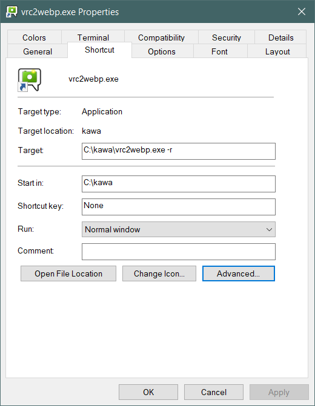
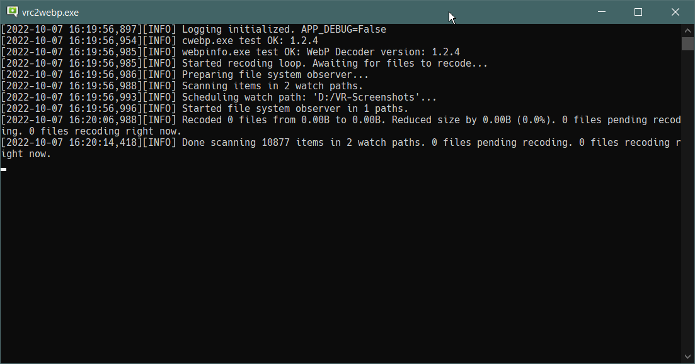

# `vrc2webp.exe`
A tool for converting (not only) VRChat camera shots from unoptimized PNGs to efficient WebPs.

( Download link at the end of page )

## What is WebP and why it's better?
WebP is new image format developed by Google. 

WebP supports transparency (just like PNG), lossless compression (just like PNG) and lossy compression (just like JPEG). 
WebP uses much better compression and need less (about 20%..30#) file size to keep same content. 
Actually **the best compression** from all common image formats, so it's best to store large massives of images. 
[You can read more about it here.](https://developers.google.com/speed/webp?hl=en)

WebP is actually widely supported right now: all modern web-browsers support it, most web-apps accept WebPs as any other image files. 
For example **Discord**, so WebPs are handy if you don't have Nitro or Boosted servers to try keep your **4K screenshots in less than 8MiB**.

Windows 10 also seems to have native support, but have issues with alpha: transparent WebPs may look like have gray/black background (but actual file is correct).

I reccomend **[XnView MP](https://www.xnview.com/en/xnviewmp/)** as powerfull image viewer, 
but if you don't want extra software and in case something fucked up you can use... ugh... ~~Macrohard Blade~~ Microsoft Edge... to open it.

**So, why not to use it to store your (not only) VRChat screenshots library more efficiently?**

## Features and how it works
- Only for Windows yet.
- [Configurable!](./assets/default.yaml)
- Can be used for **mass-recoding** any large storages of common image formats to WebP.
- But in default configuration targets for **VRChat** and **ChilloutVR** default screenshots folders.
- Can change naming pattern of VRChat screenshots for better sorting (is on by default),
    ex. `VRChat_3840x2160_2021-11-10_19-21-40.183.png` -> `VRChat_2021-11-10_19-21-40.183_3840x2160.webp`
- Can both scan for existing and observe for new files in configured folders recursively (in sub folders).
- So can be run in background with VRChat and convert screenshots **immediately** (by default).
- **Highly performant and fast as fuck:**
  - Uses **low priority** for itself, so no fight for resources with already running apps (by default).
  - Properly supports parallelism features to **utilize all your CPU cores** for best performance (by default).  
  - Writen in Python, but **translated into C and nativly compiled** by [Nuitka](https://nuitka.net/doc/user-manual.html) for best performance.
  - Uses embedded [efficient `cwebp.exe`](https://developers.google.com/speed/webp/docs/cwebp?hl=en) so no unecesary overheads by Python.
- Properly supports symbolic links and even `\\REMOTE\Shares\paths`.
- Keeps **modification time** of recoded files same as on originals (by default), so your 'Order by Date' will work fine.
- Deletes originals not permanently, but in system **Recycle Bin** (by default), just in case something fucked up and you need to recover originals. So, clean up Recycle Bin after conversion.
- Uses **lossles**s compression for **PNGs**, so no data lost, even **transparency**.
- Uses **lossy** compression with best quality for **JPEGs**, so no new artifacts.
- Uses maximum compression settings, so produces **smallest files even possible**, but may took many time for recoding process.
- Support for JPEG is enabled (by default) in case you used *\*something\** before to store your screenshots as JPEGs. EXIF metadata is **NOT** keept.
  If you used bad quality settings for your JPEGs (like 90%, 4:2:0, etc), the WebP **may not have less file size**, as `vrc2webp.exe` treats all files as high quality pictures and tries to avoid any artifacts as possible, in this case exclude JPEGs from processing in config.

## How to use
`vrc2webp.exe` is console application yet. No GUI and no plans for that. So you need to launch it with necessary arguments provden and stare into the console.

If you just run `vrc2webp.exe` you only get smol list of switches and it's description. Because if you launch a program and it start to mess with your files it's a bad practice.

To run `vrc2webp.exe` in recoding mode you need to pass `-r` argument, like that `C:\Path\To\Your\vrc2webp.exe -r`. 
You can do that in console or via `.bat` or shortcut. Example shortcut: 

It will run the program [with default configuration](./assets/default.yaml). You should get something like this: 
 

If you want to run it with your custom config, you must provide it with `-c config` argument. 
Like that `C:\Path\To\Your\vrc2webp.exe -r -c C:\Path\To\Your\config.yaml`. 
Yea, the config [in the YAML format](https://en.wikipedia.org/wiki/YAML).
Press `Ctrl+C` in console to ask the program to stop. **DO NOT** terminate `vrc2webp.exe`, especially when it does it's job: it manages child processes and unexpected things might happen if the parent just dies.

If you want to get your own copy of default config you can run `-e` (instead of `-r`) to just export the config and exit. 
You can edit exported config for yourself after that. 
Like that `C:\Path\To\Your\vrc2webp.exe -e -c C:\Path\To\Your\config.yaml`.

There is also test mode `-t` (instead of `-r` and `-e`) for testing embedded binaries and `-d` for extra debugging log messages. You don't need it.

## [Download here](https://github.com/kawashirov/vrc2webp/releases)
